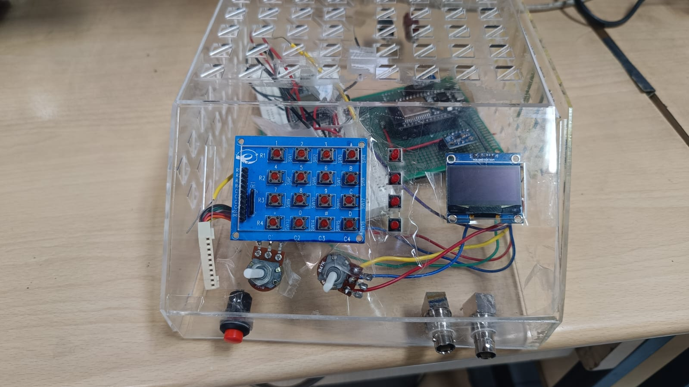

# ESP32 Dual-Channel Function Generator

An academic function-generator prototype built around an ESP32 and two AD9833 direct
digital synthesis (DDS) modules. The design combines local keypad/OLED controls with a
browser interface and analog signal conditioning for two BNC outputs.



## Features described by the report

- Two independently controlled output channels
- Sine, square, and triangle generation through AD9833 DDS modules
- ESP32-hosted Wi-Fi access point and web control
- OLED feedback and keypad-based parameter entry
- External amplification, buffering, DC offset, and BNC outputs
- Up to 20 Vpp target output into a nominal 50 Ω load
- Later prototype: ESP32 DAC arbitrary waveforms selected through an analog multiplexer
- Later prototype: ramp, impulse, and variable-duty-cycle square options

The report is inconsistent about some limits: it variously states 1 MHz clean AD9833
output, a 2 MHz requirement, and a 2.5 MHz early design goal. Treat 1 MHz as the
documented clean-output expectation and characterize the assembled analog path before
using higher frequencies.

## Architecture

```text
Keypad / controls ─┐
OLED display ──────┼── ESP32 ── SPI ── AD9833 (CH1) ──┐
Browser ── Wi-Fi ──┘         └─ SPI ── AD9833 (CH2) ──┼─ conditioning ─ BNC
                              ESP32 DAC ── MUX ─────────┘  (later prototype)
```

The report names OPA810 and LM7171 for output buffering/amplification. It also describes
physical potentiometers for final amplitude control after a digital potentiometer was
considered. More detail and the evidence boundary are in
[docs/architecture/architecture.md](docs/architecture/architecture.md).

## Repository layout

```text
firmware/                  Cleaned, syntax-level reconstructions of report listings
  app/                     Application state and limits
  display/                 Display interface declaration
  drivers/ad9833_demo/     Standalone AD9833 smoke-test sketch
  input/                   UI events and 4×4 keypad mapping
  signal/                  Signal interface declaration
  main/function_generator/ ESP32 web-backend demonstrator
web/index.html             Reconstructed browser UI
hardware/bom/bom.csv       Bill of materials transcribed from report page 26
docs/                      Architecture, hardware, report, and provenance notes
function_generator_source/ Unmodified handoff source material
  assets/                  Extracted images and selected rendered report pages
  source_reports/          Earlier 105-page report PDF
```

## Firmware status

The supplied listings do **not** form one complete firmware build:

- `app`, `display`, `input`, and `signal` provide declarations but no implementation
  source was present.
- The AD9833 listing is an isolated smoke test.
- The web backend updates in-memory state and logs commands; its report listing does not
  call the AD9833, display, keypad, DAC, multiplexer, or analog hardware.

Accordingly, the reconstructed sketches are kept separate. Combining them into production
firmware would require inventing missing implementation details, which this handoff
explicitly forbids.

## Build and use

### AD9833 smoke test

1. Install Arduino IDE and ESP32 board support.
2. Install the `MD_AD9833` Arduino library used by the report listing.
3. Open `firmware/drivers/ad9833_demo/ad9833_demo.ino`.
4. Select an ESP32-WROOM-32-compatible board and upload.

The listing uses VSPI pins SCK 18, MISO 19, MOSI 23, chip-select 5, and LED 2. It
generates a 10 Hz sine wave; this value is preserved from the code even though the
original comments claimed 1 kHz square output.

### Web-backend demonstrator

1. Open `firmware/main/function_generator/function_generator.ino` in Arduino IDE.
2. Upload it to an ESP32.
3. Connect to the `ESP32-Generator` access point using password `password123`.
4. Open the IP printed to the serial monitor (normally `192.168.4.1`).

This demonstrates the documented HTTP API and state model only. It does not drive output
hardware. The standalone UI in `web/index.html` can also be opened for visual inspection;
requests will fail when it is not served by an ESP32.

## HTTP interface

- `GET /getStatus`
- `GET /setActiveChannel?ch=1`
- `GET /setFreq?ch=1&val=1000`
- `GET /setAmp?ch=1&val=5`
- `GET /setWave?ch=1&type=sine`
- `GET /setEnable?ch=1&val=1`

These mutating `GET` routes are preserved from the report, not presented as a recommended
public API. The access point has a hard-coded demonstration password and no authorization.

## Hardware and enclosure

The report describes a 200 × 80 × 240 mm acrylic enclosure, a 1.3-inch I²C OLED,
keypad, physical amplitude and offset controls, power switch, and two BNC outputs.
Fabrication notes are in [docs/hardware/enclosure.md](docs/hardware/enclosure.md), and
the transcribed costed BOM is in [hardware/bom/bom.csv](hardware/bom/bom.csv).

Use appropriate output protection and verify rail voltages, op-amp stability, thermal
behavior, and output amplitude on a current-limited bench supply. The report is not a
substitute for a complete electrical schematic.

## Media

The source package includes extracted prototype photos, diagrams, a schematic image, and
selected rendered pages from the earlier report. See the
[media manifest](function_generator_source/assets/MEDIA_MANIFEST.md) for page and image
object mapping. The manifest predates several additional extracted files in the directory,
so the archive itself is authoritative.

## Testing and results

The report records preliminary OLED breadboard validation, CAD clearance checks, and a
final assembled prototype described as stable and more usable than earlier iterations.
It does not provide reproducible oscilloscope captures, calibration data, distortion,
frequency-response, load-regulation, or electrical-safety test procedures in the supplied
package. No automated tests can validate the absent hardware implementations.

## Report, team, and references

- [Report provenance and source inventory](docs/report/README.md)
- [Complete extracted 109-page report text](function_generator_source/LATEST_INDEXED_REPORT_FULL_TEXT.txt)
- [Original extracted code listings](function_generator_source/extracted_code/)
- [External resources found in the report](function_generator_source/LINKS_AND_EXTERNAL_RESOURCES.md)

The complete report includes the full 87-member team list and meeting records. They are
kept in the source text to preserve names, roles, and wording without reinterpreting
authorship.

## Repository status

| Item | Status |
| --- | --- |
| Latest report text | Present |
| Earlier 105-page raw PDF | Present |
| Extracted images and selected rendered pages | Present |
| Extracted report code listings | Present; spacing damaged by PDF extraction |
| Syntax-cleaned listing reconstructions | Present |
| Complete integrated firmware | Not present in source package |
| CAD/PCB/Gerber source | Not present |
| Explicit project license | Not present |

No license is asserted because the source package supplied none. All rights remain with
the original authors unless they publish license terms.
